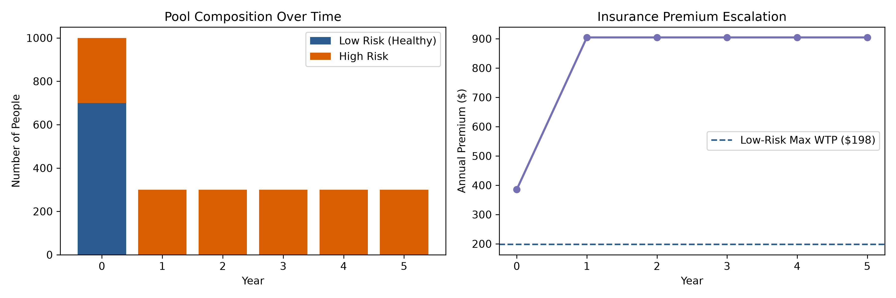

# Equilibrium Breakdown in Voluntary Health Pools: An Actuarial & Microeconomic Simulation

## 1. Executive Summary
This project models the structural collapse ("death spiral") of a private health insurance pool operating under unobservable risk heterogeneity. By integrating **CS1** compound frequency-severity processes, **CB2** consumer reservation utility curves, and **CM1** equivalence-principle office pricing, the model demonstrates how the absence of risk-differentiated underwriting converts an initially solvent pool into market failure within four renewal cycles.

---

## 2. Theoretical Framework

### Microeconomic Foundation 
Following Akerlof (1970) and Rothschild & Stiglitz (1976), when an insurer cannot observe individual risk profiles, it charges a pooled premium $P_t$. Risk-averse consumers purchase coverage only if the certain loss of the premium provides greater utility than retaining the underlying risk:

$$U(W - P_t) \ge \mathbb{E}[U(W - S_i)]$$

We formalize consumer drop-out via an empirical reservation price (Willingness to Pay, $\text{WTP}_i$) and a price-elasticity lapse function:

$$\text{Lapse Rate}_{i,t} = \min\left(1.0, \; \epsilon_i \cdot \frac{\max(0, P_t - \text{WTP}_i)}{\text{WTP}_i}\right)$$

### Aggregate Claim Process 
For an active cohort $k \in \{\text{Low}, \text{High}\}$, aggregate annual losses $S_k$ are modeled as a collective risk process:

$$S_k = \sum_{j=1}^{N_k} X_j, \quad N_k \sim \text{Poisson}(\lambda_k), \quad X_j \sim \text{Gamma}(\alpha, \beta)$$

Where $\lambda_{\text{Low}} = 0.10$, $\lambda_{\text{High}} = 0.65$, and mean severity $\mathbb{E}[X] = \alpha \beta = \$1,200$.

### Actuarial Repricing Engine 
At each renewal $t+1$, the insurer reprices the annual office premium $P_{t+1}$ using the Equivalence Principle, incorporating both per-policy overhead expenses and proportional loadings:

$$P_{t+1} = \frac{\bar{S}_{t+1} + e_{\text{fixed}}}{1 - e_{\text{variable}} - m}$$

Where $e_{\text{fixed}} = \$25$, $e_{\text{variable}} = 0.06$, and target profit margin $m = 0.05$.

---

## 3. Simulation Dynamics & Results

The simulation tracks an initial risk pool of 1,000 policyholders (70% Low-Risk, 30% High-Risk) across 6 consecutive annual renewals:

| Cycle | Low-Risk ($N_L$) | High-Risk ($N_H$) | Total In-Force | High-Risk Share | Office Premium ($P_t$) | Mean Loss / Head | Pool Status |
| :---: | :---: | :---: | :---: | :---: | :---: | :---: | :---: |
| **0** | 700 | 300 | 1,000 | 30.0% | **$385.39** | $326.15 | Inception (Solvent) |
| **1** | 0 | 300 | 300 | 100.0% | **$904.49** | $761.56 | Adverse Selection Triggered |
| **2** | 0 | 300 | 300 | 100.0% | **$904.49** | $814.58 | Sub-Pool Equilibrium |
| **3** | 0 | 300 | 300 | 100.0% | **$904.49** | $836.57 | Monolithic High-Risk Pool |

### Visualizing the Pool Collapse

### Key Observations:
1. **Immediate Initial Shock:** Because the initial fair pooled premium ($385.39) exceeded the maximum willingness-to-pay of the healthy cohort ($\text{WTP}_L = \$198.00$), 100% of low-risk lives lapsed in the first renewal cycle.
2. **Repricing Surge:** The exit of low-risk policyholders forced the office premium to jump by **134.7%** (from $385.39 to $904.49) to restore equivalence on the remaining high-risk cohort.
3. **High-Risk Thresholding:** The pool stabilized temporarily at 300 members only because the high-risk cohort's reservation price ($\text{WTP}_H = \$1,014.00$) remained above the re-priced premium.

---

## 4. Actuarial Risk Mitigations

To prevent pool dissolution under asymmetric conditions, insurers implement structural mechanisms:
* **Product Tiering & Self-Selection (Screening):** Offering paired contracts—a low-premium, high-deductible policy preferred by healthy lives, alongside a high-premium, comprehensive policy chosen by high-risk lives.
* **Underwriting & Risk Scoring:** Requiring evidence of insurability to segment lives into distinct pricing rating classes.
* **Compulsory Pooling:** Universal or employment-based mandates that eliminate voluntary attrition.
